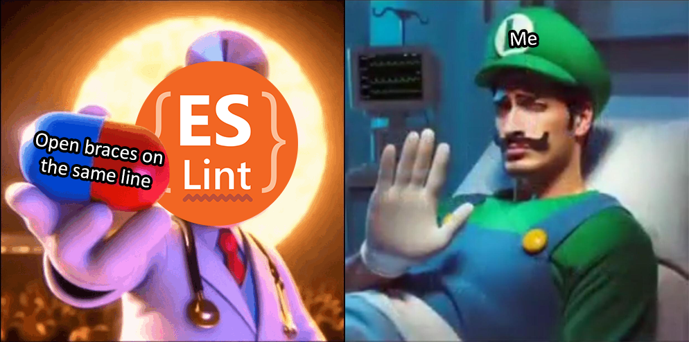

On my journey to learn different programming languages, a recurring theme between each of them is the fact that I’m instructed to follow some coding standards for each language. Coding is awesome because there are so many ways to write code that all compile and run correctly. However, when working with coding standards, you can have written code that works just fine, but violates standards, forcing you to adjust what you wrote. At first glance, this seems like it sucks. Why do I have to write all my code in this specific way when my own coding style works just fine?

## The Importance of Coding Standards

The answer lies in the fact that not all coding styles are equal. Take this snippet of TypeScript code for example:

```typescript
function a(b){var c=0;for(var d=0;d<b.length;d++){if(b[d]%2==0){c+=b[d];}}return c}console.log(a([1,2,3,4,5,6,7,8,9,10]));
```

This code compiles and runs perfectly fine, but can you tell me what the purpose of this code is? I wouldn’t be able to tell you without looking at it for a couple of minutes. 

Now let’s look at code that does the exact same thing, but styled differently:

```typescript
function sumEvenNumbers(numbers) {
    let sum = 0;
    for (let i = 0; i < numbers.length; i++) {
        if (numbers[i] % 2 === 0) {
            sum += numbers[i];
        }
    }
    return sum;
}

const result = sumEvenNumbers([1, 2, 3, 4, 5, 6, 7, 8, 9, 10]);
console.log(result);
```

Now, it’s much easier to tell what this code does. Even if code does compile and run without issue, it’s important to be able to write code that is understandable upon a glance. This is because when working in a team, code is often looked at, edited, and improved by multiple people. The answer to the question: “Why follow a coding style when my code works fine” is that, in the real world, coding is often done collaboratively, so making sure others can understand your code is critical to finding success.

## Adapting to ESLint

The most recent coding standard I’ve been getting accustomed to is ESLint for TypeScript. Here’s some JavaScript code that compiles and runs just fine, and also is easily readable:

```typescript
function greet(name) {
    if (name == "World") {
        console.log("Hello, World!");
    } else {
        console.log("Hello, " + name + "!");
    }
}

greet("Alice");
```

Through ESLint’s coding standards, there are multiple things that I would need to fix about this code snippet. I’m told to use single quotes for strings instead of double quotes, opening braces should be on the same line, I should use `===` instead of `==`, and I need an empty newline at the end of my code. It would look something like this:

```typescript
function greet(name) {
    if (name === 'World') {
        console.log('Hello, World!');
    } else {
        console.log('Hello, ' + name + '!');
    }
}

greet('Alice');
```

For the most part, it’s not too difficult to follow ESLint standards, but it’s a little annoying to follow sometimes. I’ve grown accustomed to opening braces on their own line, instead of on the same line, so having to fix it whenever I write my code like that occasionally kind of sucks. Although I could argue that both code snippets are perfectly human-readable, there may be a good reason to explain why following the code standard outside of readability. I will continue to follow these standards, even though they are annoying sometimes.

