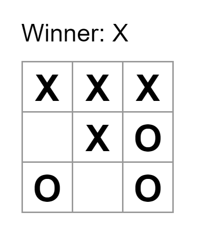

Writing code is both the most repetitive, but most unique thing I've had the chance to do over these past couple of years. Time and time again, I have to write a program to do something, and I end up reusing a similar approach to a problem that I've already written down before. A few months ago, I've encountered a challenge that required me to reuse a similar approach to complete it, and I'd like to tell the story about it.

### The Challenge

My challenge was a homework assignment, to create a tic-tac-toe game on a website. The main challenge was figuring out how to manage user interactions, as I'm already experienced enough to program the rules of the game. In order to handle these user interactions, I needed to rely on React's event handling system. I assigned a click handler to each tile that updated the game state whenever a player made a move. I made use of React's useState function to maintain the state of the game, so I could track who's turn it was, what tiles were already chosen, and if someone had won. 

### The Design Pattern

Unknowingly, I applied a design pattern called the Observer Pattern in my implementation. Every tile in my game was a subject that told my game whenever a change would occur, and the logic of my game was the observer that responded to the updates, adding the Xs and Os, and declaring winners when it happened.

This is not the only time I've made use of the Observer Pattern, I've used it in nearly every application I've created that involves user interaction! I admit that making use of event handlers every time, especially if an app calls for many, gets pretty repetitive. But every event handler I've written was unique to the specific case I was using it for, which is what's so interesting about Design Patterns. As it turns out, there are a ton of other Design Patterns such as the Adapter that allows two incompatible interfaces to interact, or the State pattern that allows an object to change it's behavior if some kind of state is changed.

The funniest thing about this is that I've been applying all these patterns without even realizing it. Looking back, I can recognize patterns in my past code, and even though the exact details of each implementation differs, the fundamental principle remains the same. Writing code is so cool, it's so repetitive but so variable and able to change all at the same time. 