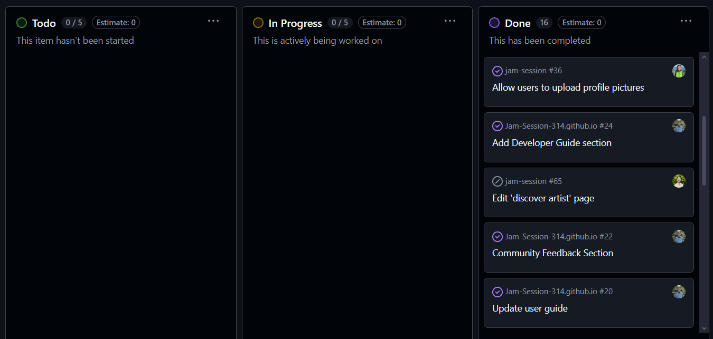

I've finished taking the last of my final exams for this semester, which means it's time for me to reflect one last time of what I've truly learned from each of my classes. This essay in particular will focus on my software engineering class, since I have this class to thank for teaching me how to set up and edit this website. 

## What I've Learned
This class has given me technical experience with a few big software topics such as Typescript, React, GitHub, and PostgreSQL. It's quite obvious that I've learned how to do some programming after taking a software engineering class. What I wanted to reflect on goes deeper than just that, though. Beyond the simple experience with programming and web development, I wanted to look back and understand the core skills that this class has helped me gain, that will **continue** to help me no matter what career path I may take.

### Coding Standards

One thing I want to reflect on is how I've learned about working with coding standards. I learned that coding standards, [as discussed in this essay](https://codygt3.github.io/essays/coding-standards.html) are sort of like rules that dictate how you should write your code. You could have code that works fine...

```typescript
function a(b){var c=0;for(var d=0;d<b.length;d++){if(b[d]%2==0){c+=b[d];}}return c}console.log(a([1,2,3,4,5,6,7,8,9,10]));
```

but violates the coding standard, meaning you have to adjust it...

```typescript
function sumEvenNumbers(numbers) {
    let sum = 0;
    for (let i = 0; i < numbers.length; i++) {
        if (numbers[i] % 2 === 0) {
            sum += numbers[i];
        }
    }
    return sum;
}

const result = sumEvenNumbers([1, 2, 3, 4, 5, 6, 7, 8, 9, 10]);
console.log(result);
```

despite it already working just fine. This concept of having to do something a certain way, even if there are other ways to do it, is not specific to programming. The idea that there should be a standardized method of doing things is very important in many practical areas, such as healthcare or construction. For example, a nurse might think it's okay to give a patient medication on a specific schedule based on their own or the patient's judgments or preferences. Although this would be easy and might not be bad at all, there exist healthcare standards such as the [Five Rights of Medication Administration](https://pmc.ncbi.nlm.nih.gov/articles/PMC2957754/#:~:text=Most%20health%20care%20professionals%2C%20especially,standard%20for%20safe%20medication%20practices.) that would tell the nurse to follow a different method of prescribing medication that has been proven to minimize human error and ensure the safety of the patient. This concept mirrors what I've learned in my software engineering class! While there may be alternative ways to build or code something, following existing standards can ultimately lead to something more reliable or easier to work with later down the line. 

### Project Management

Another thing I wanted to reflect on is about working in a team environment, making use of *Issue Driven Project Management* in particular to get a project done. Issue Driven management is a kind of management strategy that some teams employ to stay organized and productive. The way it works is that the team has a kind of *issue board* that lists a bunch of issues that they want to fix about their software. These issues can be anything from bug fixes, new features, or redesigns of certain pages. The team would then assign issues to one another, and mark the issues as either in-progress or complete. I used this strategy to develop my final project for this class, actually. Here's a screenshot of what my issue board looked like at the end:




Of course, the board has been entirely completed, but you can try to imagine how it looked like as we were working on it. This strategy of project development can definitely be applied to other projects outside of computer science. I can already imagine using this strategy to plan events such as parties or speaker sessions. I can create issues such as "Book venue", "Redesign invitations", or "modify schedule", and assign them to other planners in order to pull off the perfect event. 

### Conclusion

It was pretty fun to think about how the concepts in my software engineering class could be applied outside of the computer science field in general. I'm grateful for taking this class, and I'm looking forward to applying these concepts wherever I go in the future!