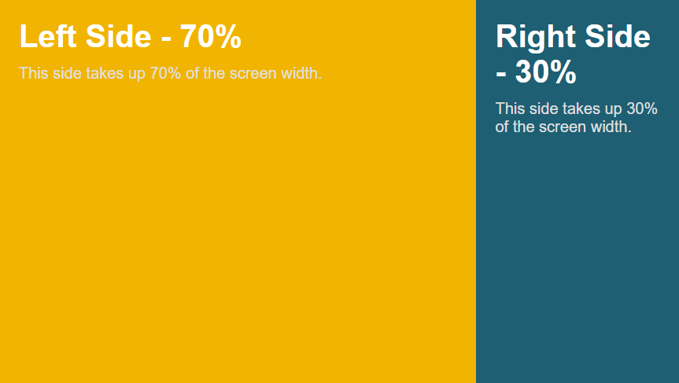
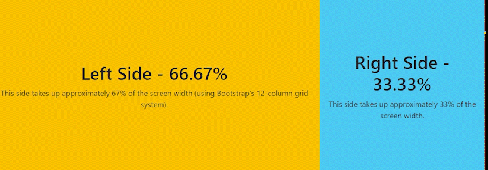
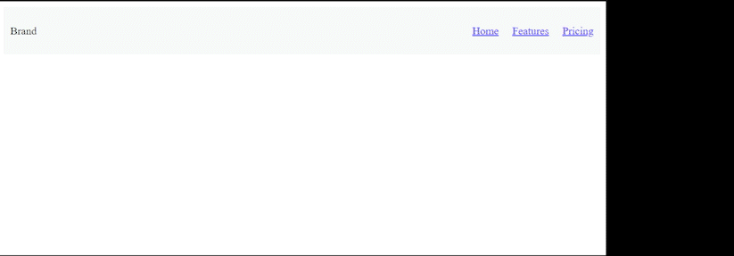

  

Let’s say you wanted to create a webpage for a new business you’re starting up. When it comes to how you’ll create this webpage, you have two options:

- Write the webpage in raw HTML and CSS

- Use a UI framework such as Bootstrap to build the webpage

  

Let’s weigh the benefits and drawbacks of each option, so we can pick the one that works best for us.

  

## Raw HTML and CSS

When writing raw HTML and CSS, you have full control over the design and layout of the webpage. You can customize this webpage as much as you like, as long as you’re capable of writing it. This means that every element, from the positioning of text and images to the overall look and feel of the site, is entirely up to you. No predefined constraints or templates will limit your creativity, allowing for truly unique designs that match your specific vision.

  

However, this flexibility comes at a cost. Building a webpage from scratch requires a solid understanding of both HTML and CSS, and possibly JavaScript if you want to add interactivity. You’ll need to invest more time and effort into creating seemingly simple elements such as navigation bars, buttons, or grids. For beginners or those working under tight deadlines, this approach can be pretty intimidating.

  

Additionally, maintaining and updating a raw HTML/CSS site can become increasingly complex as the project grows. Without a solid structure, you might run into challenges with consistency and scalability, especially if you don’t have a clear design system in place.

  

## UI Framework

A UI framework is a collection of pre-built components, styles, and tools designed to streamline the process of building user interfaces. Instead of writing all the HTML, CSS, and JavaScript from scratch, a UI framework provides ready-made templates and elements like buttons, navigation bars, grids, and forms. UI frameworks are essentially toolkits that help you create attractive, functional websites more efficiently. They come with built-in design conventions, which can save you from reinventing the wheel every time you need to create common web elements. Instead of manually coding everything, you can leverage pre-existing styles and components to rapidly prototype or build fully functional websites.

  

While these frameworks are convenient, they often come with default styles and structures that may limit your ability to fully customize your design. It can get pretty frustrating trying to override templates set by the framework to get your idea exactly right, when doing it in raw HTML and CSS would be much easier.

  

For example, I want to have two sections in my webpage, the left taking up 70% of the screen, and the right taking up 30%. It would look something like this:

  

  

With HTML and CSS, this would be pretty easy:

  

### HTML:

    

        

            <h1>Left Side - 70%</h1>
            
This side takes up 70% of the screen width.

        

        

            <h1>Right Side - 30%</h1>
            
This side takes up 30% of the screen width.

        

    
  
### CSS:

    .container {
    display: flex;
    height: 100vh;
    }
    
    .left-side {
    background-color: #f8b400;
    width: 70%;
    padding: 20px;
    }
    
    .right-side {
    background-color: #005f73;
    width: 30%;
    padding: 20px;
    

Now, trying to use bootstrap only to create this kind of webpage doesn’t work out as well as I would hope:

  

### HTML:

    

        

            

                

                    <h1>Left Side - 66.67%</h1>
                    
This side takes up approximately 67% of the screen width (using Bootstrap's 12-column grid system).

                

            

            

                

                    <h1>Right Side - 33.33%</h1>
                    
This side takes up approximately 33% of the screen width.

                

            

        

    

  

This kind of works, although when I resize the window:

  

  

The right section just gets removed on smaller screens. I would have to override some of Bootstrap’s classes in order to get it to work the way I wanted it to, and that’s the price you pay for using frameworks.

  

But on the other hand, creating a navbar that turns into a collapsible menu is much easier using Bootstrap. In Bootstrap, with just HTML:

  

### HTML:

    <nav class="navbar navbar-expand-lg navbar-light bg-light">
        <a class="navbar-brand" href="#">Brand</a>
        <button class="navbar-toggler" type="button" data-bs-toggle="collapse" data-bs-target="#navbarNav" aria-controls="navbarNav" aria-expanded="false" aria-label="Toggle navigation">
            
        </button>
        

            <ul class="navbar-nav">
                <li class="nav-item">
                    <a class="nav-link" href="#">Home</a>
                </li>
                <li class="nav-item">
                    <a class="nav-link" href="#">Features</a>
                </li>
                <li class="nav-item">
                    <a class="nav-link" href="#">Pricing</a>
                </li>
            </ul>
        

    </nav>

  

I get a navbar that looks like this:

  

  

Doing this with raw HTML and CSS is much harder, and even requires JavaScript:

  

### HTML:

    <nav class="navbar">
        
Brand

        

            &#9776;
        

        <ul class="navbar-menu" id="navbar-menu">
            <li class="nav-item"><a href="#">Home</a></li>
            <li class="nav-item"><a href="#">Features</a></li>
            <li class="nav-item"><a href="#">Pricing</a></li>
        </ul>
    </nav>

  

### CSS:

~~~
/* Basic navbar styling */
.navbar {
    display: flex;
    justify-content: space-between;
    align-items: center;
    background-color: #f8f9fa;
    padding: 10px;
}

.navbar-menu {
    display: flex;
    list-style: none;
}

.navbar-menu li {
    margin-left: 20px;
}

.navbar-toggle {
    display: none;
    cursor: pointer;
    font-size: 24px;
}

/* Responsive layout: hamburger menu for smaller screens */
@media (max-width: 768px) {
    .navbar-menu {
        display: none;
        flex-direction: column;
        position: absolute;
        top: 50px;
        left: 0;
        width: 100%;
        background-color: #f8f9fa;
    }

    .navbar-menu.show {
        display: flex;
    }

    .navbar-toggle {
        display: block;
    }
}

~~~

  

### JS:

    document.getElementById('navbar-toggle').addEventListener('click', function () {
    var menu = document.getElementById('navbar-menu');
    menu.classList.toggle('show');
    });

  

With all of that work, it looks like this:

  

  

There’s no contest, with Bootstrap it was trivial.

### Conclusion

Using a UI framework can have its headaches, but if I need to get something basic done quickly, I’ll stick with something like Bootstrap since it gets the job done fast. One thing I didn’t mention is that frameworks are great in team settings. When everyone follows the same structure, it’s easier to work together. With raw HTML and CSS, there are so many ways to structure things that it can be tough to understand someone else’s setup, especially if it only makes sense to them.

