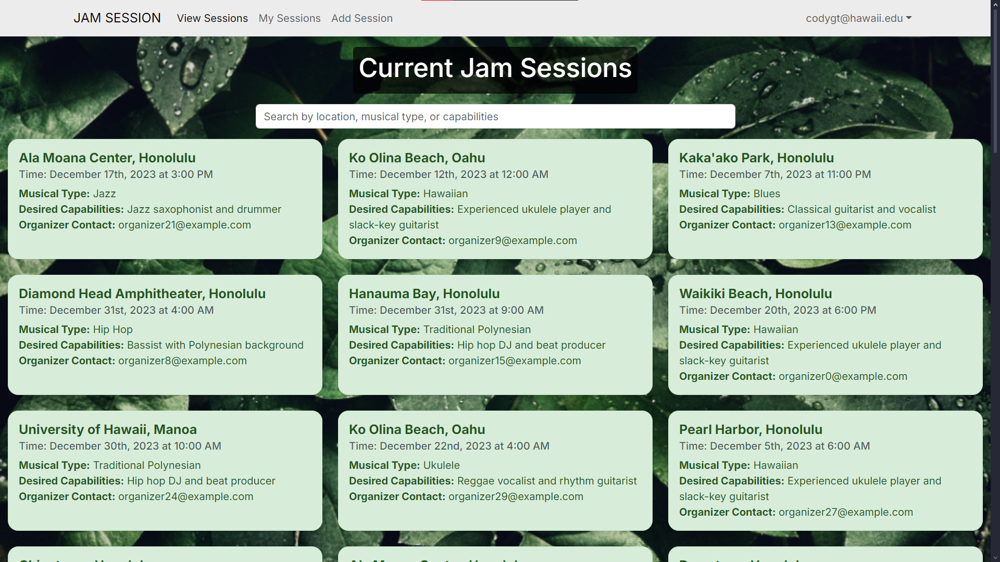

The final project for my Software Engineering class was to work as a team to create a web application using Next.js and PostgreSQL. The application we ended up creating is called "Jam Session", and the goal of this application was to be a platform where music enjoyers can schedule in-person jam sessions so they can make music together. Here's a screenshot of what the session view page looks like:

A big part of this project was learning how to develop as a team. We learned how to use a strategy called "Issue Project Driven Management", which is a strategy that's about creating a board that has a bunch of issues that need to be resolved. These issues could range from "Create the profile page" to "Redesign the session page". As a team, we'd create and assign these issues to each other, and mark them as either in-progress or completed. 

The contributions to this project revolve mostly around how it interacts with the postgreSQL database and the styling of the page. I had to adjust how the database worked in order to incorporate the features of jam sessions and user profiles. I also was the one that created the jam session card, and the one that styled a few of the pages. 

[Here](https://github.com/Jam-Session-314) is a link to the organizational home page on GitHub, and [here's](https://jam-session-314.github.io) a link to the website we made with more details about the project.