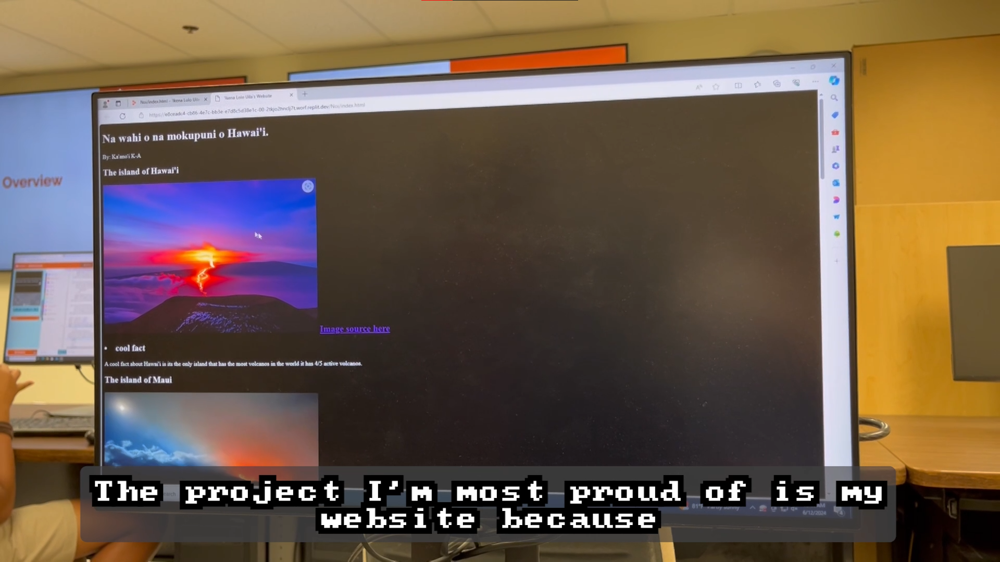

Over the summer of 2024 I was a computer science teacher for Nā Pua No'eau's Summer Insitute. It was a four week program, which had two sessions that were two weeks each. The two sessions took place on campus at UH Manoa, and consisted of five different courses for each, the course I was a part of being 'Ikena Lolo Uila, or computer science. 

Before this program started, with the help of two other students, we had to develop a curriculum alongside slides to teach the students. We settled with a four project curriculum, with the four projects being a retro game, a python chatbot, a digital safety booklet, and a website. This meant that I had to be familiar with each project in order to be able to best help the students, so I had practiced making games on Microsoft MakeCode Arcade, using Python to make a chatbot, HTML CSS and Javascript to develop a website, and some artistic ability to create a digital booklet.

I had contributed the slides for both the digital safety booklet and Python lecture slides, and had led most of the lectures involving programming. I learned that I couldn't do everything alone, and that I had to rely on the other teacher to handle some of the lectures as well. Below is a sample of a slide I had presented.

At the end of each session, the students and teachers would celebrate by hosting a showcase night where parents of the students would come to see their kids perform Hawaiian dances, chants, as well as discover what the students had learned from their teachers. This was done in the form of a video that the teachers create, so I had to use my video creating skills to produce a video demonstrating all the projects that the students had made. Below is a frame from the showcase video I had made.

